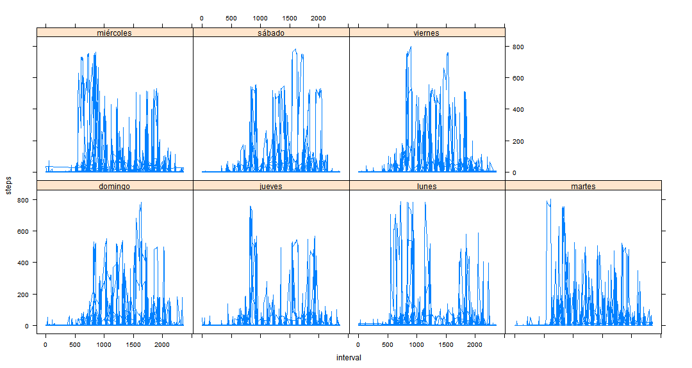

# Reproducible Research: Peer Assessment 1

## Loading and preprocessing the data

We will follow the next sequence of steps

1st step downloading the file from the adresss http://d396qusza40orc.cloudfront.net/repdata/data/activity.zip. If we download manually it should be available for R


```r
download.file("http://d396qusza40orc.cloudfront.net/repdata/data/activity.zip", 
    "activity.zip")
```


2nd step requires loading the data into memory. For this purpose we should first unzip the resulting file 


```r
unzip("activity.zip", "activity.csv")
```


3rd Step: then we can directly load the file dataset


```r
activity <- read.csv("activity.csv")
```


4th Step: Then a dataframe called activity has been loaded in memory that we can review


```r
str(activity)
```

```
## 'data.frame':	17568 obs. of  3 variables:
##  $ steps   : int  NA NA NA NA NA NA NA NA NA NA ...
##  $ date    : Factor w/ 61 levels "2012-10-01","2012-10-02",..: 1 1 1 1 1 1 1 1 1 1 ...
##  $ interval: int  0 5 10 15 20 25 30 35 40 45 ...
```

```r
head(activity)
```

```
##   steps       date interval
## 1    NA 2012-10-01        0
## 2    NA 2012-10-01        5
## 3    NA 2012-10-01       10
## 4    NA 2012-10-01       15
## 5    NA 2012-10-01       20
## 6    NA 2012-10-01       25
```

```r
summary(activity$steps)
```

```
##    Min. 1st Qu.  Median    Mean 3rd Qu.    Max.    NA's 
##     0.0     0.0     0.0    37.4    12.0   806.0    2304
```


## What is mean total number of steps taken per day?

We will now follow the next sequence

1st step aggregate results of steps per date in a new dataframe called agresteps


```r
agresteps <- aggregate(activity$steps, list(activity$date), sum)
str(agresteps)
```

```
## 'data.frame':	61 obs. of  2 variables:
##  $ Group.1: Factor w/ 61 levels "2012-10-01","2012-10-02",..: 1 2 3 4 5 6 7 8 9 10 ...
##  $ x      : int  NA 126 11352 12116 13294 15420 11015 NA 12811 9900 ...
```


2nd step obtaining the statistics of the data


```r
mean(agresteps$x, na.rm = TRUE)
```

```
## [1] 10766
```

```r
median(agresteps$x, na.rm = TRUE)
```

```
## [1] 10765
```

```r
sd(agresteps$x, na.rm = TRUE)
```

```
## [1] 4269
```


Then we can show the distribution of daily steps


```r
hist(agresteps$x, xlab = "Steps per day", main = "Distribution of steps", ylab = "Frequency")
abline(v = mean(agresteps$x, na.rm = TRUE))
```

 


## What is the average daily activity pattern?

The question now is to calculate the mean steps per interval, for this purpose we first create a new dataframe


```r
agreinterval <- aggregate(activity$steps, list(activity$interval), mean, na.rm = TRUE)
str(agreinterval)
```

```
## 'data.frame':	288 obs. of  2 variables:
##  $ Group.1: int  0 5 10 15 20 25 30 35 40 45 ...
##  $ x      : num  1.717 0.3396 0.1321 0.1509 0.0755 ...
```


and then plot the series


```r
plot(agreinterval, type = "l", main = "Average data per 5 min interval", xlab = "hour", 
    ylab = "steps", xaxt = "n")
axis(side = 1, at = c(0, 500, 1000, 1500, 2000, 2400), labels = c("00:00", "05:00", 
    "10:00", "15:00", "20:00", "24:00"))
abline(h = max(agreinterval$x), col = "blue")
abline(h = mean(agreinterval$x, na.rm = TRUE), col = "red")
abline(v = agreinterval$Group.1[which.max(agreinterval$x)], col = "blue")
```

 


The maximum value for the series is

```r
max(agreinterval$x)
```

```
## [1] 206.2
```


and the hour of the day corresponding with the max is given by

```r
agreinterval$Group.1[which.max(agreinterval$x)]
```

```
## [1] 835
```


and the average

```r
mean(agreinterval$x, na.rm = TRUE)
```

```
## [1] 37.38
```

## Imputing missing values

We first check the number of NA data and the percentage of errors


```r
n <- summary(activity$steps)[7]
n
```

```
## NA's 
## 2304
```

```r
m <- nrow(activity)
m
```

```
## [1] 17568
```

```r
# % of NA cases
n/m * 100
```

```
##  NA's 
## 13.11
```


we create a new dataframe and correct NA with average data per interval


```r
activity_imput <- activity
for (i in 1:dim(activity)[1]) {
    if (is.na(activity$steps[i])) {
        activity_imput$steps[i] <- agreinterval$x[which(agreinterval$Group.1 == 
            activity_imput$interval[i])]
    }
}
```


Then we can check the new dataframe


```r
agresteps_im <- aggregate(activity_imput$steps, list(activity_imput$date), sum)
str(agresteps_im)
```

```
## 'data.frame':	61 obs. of  2 variables:
##  $ Group.1: Factor w/ 61 levels "2012-10-01","2012-10-02",..: 1 2 3 4 5 6 7 8 9 10 ...
##  $ x      : num  10766 126 11352 12116 13294 ...
```

```r
summary(agresteps_im$x)
```

```
##    Min. 1st Qu.  Median    Mean 3rd Qu.    Max. 
##      41    9820   10800   10800   12800   21200
```


versus the previous version


```r
str(agresteps)
```

```
## 'data.frame':	61 obs. of  2 variables:
##  $ Group.1: Factor w/ 61 levels "2012-10-01","2012-10-02",..: 1 2 3 4 5 6 7 8 9 10 ...
##  $ x      : int  NA 126 11352 12116 13294 15420 11015 NA 12811 9900 ...
```

```r
summary(agresteps$x)
```

```
##    Min. 1st Qu.  Median    Mean 3rd Qu.    Max.    NA's 
##      41    8840   10800   10800   13300   21200       8
```

No relevant change in mean but some changes in sd


```r
mean(agresteps_im$x, na.rm = TRUE)
```

```
## [1] 10766
```

```r
median(agresteps_im$x, na.rm = TRUE)
```

```
## [1] 10766
```

```r
sd(agresteps_im$x, na.rm = TRUE)
```

```
## [1] 3974
```


The histograms now can be compared 

```r
par(mfrow = c(1, 2))
hist(agresteps$x, xlab = "Steps per day", main = "Distribution of steps (initial)", 
    ylab = "Frequency")
abline(v = mean(agresteps$x, na.rm = TRUE))
hist(agresteps_im$x, xlab = "Steps per day", main = "Distribution of steps(corrected)", 
    ylab = "Frequency")
abline(v = mean(agresteps_im$x, na.rm = TRUE))
```

 

```r
par(mfrow = c(1, 1))
```


About the distribution of activity along the day we generate a new dataframe

```r
agreinterval_im <- aggregate(activity_imput$steps, list(activity_imput$interval), 
    mean, na.rm = TRUE)
str(agreinterval_im)
```

```
## 'data.frame':	288 obs. of  2 variables:
##  $ Group.1: int  0 5 10 15 20 25 30 35 40 45 ...
##  $ x      : num  1.717 0.3396 0.1321 0.1509 0.0755 ...
```


and then plot the series


```r
par(mfrow = c(1, 2))
plot(agreinterval, type = "l", main = "Average data per 5 min interval(initial)", 
    xlab = "hour", ylab = "steps", xaxt = "n")
axis(side = 1, at = c(0, 500, 1000, 1500, 2000, 2400), labels = c("00:00", "05:00", 
    "10:00", "15:00", "20:00", "24:00"))
abline(h = max(agreinterval$x), col = "blue")
abline(h = mean(agreinterval$x, na.rm = TRUE), col = "red")
abline(v = agreinterval$Group.1[which.max(agreinterval$x)], col = "blue")
plot(agreinterval_im, type = "l", main = "Average data per 5 min interval(corrected)", 
    xlab = "hour", ylab = "steps", xaxt = "n")
axis(side = 1, at = c(0, 500, 1000, 1500, 2000, 2400), labels = c("00:00", "05:00", 
    "10:00", "15:00", "20:00", "24:00"))
abline(h = max(agreinterval_im$x), col = "blue")
abline(h = mean(agreinterval_im$x, na.rm = TRUE), col = "red")
abline(v = agreinterval_im$Group.1[which.max(agreinterval_im$x)], col = "blue")
```

 

```r

par(mfrow = c(1, 1))
```


## Are there differences in activity patterns between weekdays and weekends?

To check this we should identify two subsets in the initial dataframe, first for weekends, second for weekdays.We will use corrected dataset

The procedure then is 
1st step  transform initial data data for dates into Date class

```r
activity_imput$date <- as.Date(as.character(activity_imput$date), "%Y-%m-%d")
head(activity$imput)
```

```
## NULL
```


2nd step create a factor variable in dataframe capturing the days of the week
(sorry days appear to be in spanish¡¡¡¡)

```r
activity_imput$day <- weekdays(activity_imput$date)
head(activity$imput)
```

```
## NULL
```

```r
unique(activity_imput$day)
```

```
## [1] "lunes"     "martes"    "miércoles" "jueves"    "viernes"   "sábado"   
## [7] "domingo"
```


We can now observe the different distributions of activity per day of the week 

```r
library(lattice)
activity_imput <- transform(activity_imput, day = factor(day))
xyplot(steps ~ interval | day, data = activity_imput, layout = c(3, 3), type = "l")
```

 

We can now summarize two different subsets one for weekend and one for working days

```r
wd <- c("lunes", "martes", "miércoles", "jueves", "viernes")
we <- c("sábado", "domingo")
activity_imput$w[activity_imput$day %in% we] = "weekend"
activity_imput$w[activity_imput$day %in% wd] = "workday"
head(activity_imput)
```

```
##     steps       date interval   day       w
## 1 1.71698 2012-10-01        0 lunes workday
## 2 0.33962 2012-10-01        5 lunes workday
## 3 0.13208 2012-10-01       10 lunes workday
## 4 0.15094 2012-10-01       15 lunes workday
## 5 0.07547 2012-10-01       20 lunes workday
## 6 2.09434 2012-10-01       25 lunes workday
```


With this data we can now reproduce the analysis for total steps


```r
agresteps_we <- aggregate(activity_imput$steps[activity_imput$w == "weekend"], 
    list(activity_imput$date[activity_imput$w == "weekend"]), sum)
agresteps_wd <- aggregate(activity_imput$steps[activity_imput$w == "workday"], 
    list(activity_imput$date[activity_imput$w == "workday"]), sum)
str(agresteps_we)
```

```
## 'data.frame':	16 obs. of  2 variables:
##  $ Group.1: Date, format: "2012-10-06" "2012-10-07" ...
##  $ x      : num  15420 11015 12426 15098 10395 ...
```

```r
str(agresteps_wd)
```

```
## 'data.frame':	45 obs. of  2 variables:
##  $ Group.1: Date, format: "2012-10-01" "2012-10-02" ...
##  $ x      : num  10766 126 11352 12116 13294 ...
```


The statistics now split between the two groups.

a) For weekends

```r
mean(agresteps_we$x, na.rm = TRUE)
```

```
## [1] 12202
```

```r
median(agresteps_we$x, na.rm = TRUE)
```

```
## [1] 11646
```

```r
sd(agresteps_we$x, na.rm = TRUE)
```

```
## [1] 2083
```


b) For working days

```r
mean(agresteps_wd$x, na.rm = TRUE)
```

```
## [1] 10256
```

```r
median(agresteps_wd$x, na.rm = TRUE)
```

```
## [1] 10765
```

```r
sd(agresteps_wd$x, na.rm = TRUE)
```

```
## [1] 4364
```


We observe that there is more activity on weekends than in working day.

The histograms now can be compared 

```r
par(mfrow = c(1, 2))
hist(agresteps_we$x, xlab = "Steps per day", main = "Distribution of steps (weekends)", 
    ylab = "Frequency")
abline(v = mean(agresteps_we$x, na.rm = TRUE))
hist(agresteps_wd$x, xlab = "Steps per day", main = "Distribution of steps(working days)", 
    ylab = "Frequency")
abline(v = mean(agresteps_wd$x, na.rm = TRUE))
```

 

```r
par(mfrow = c(1, 1))
```


And for the distribution along the day

```r
agreinterval_we <- aggregate(activity_imput$steps[activity_imput$w == "weekend"], 
    list(activity_imput$interval[activity_imput$w == "weekend"]), mean, na.rm = TRUE)
agreinterval_wd <- aggregate(activity_imput$steps[activity_imput$w == "workday"], 
    list(activity_imput$interval[activity_imput$w == "workday"]), mean, na.rm = TRUE)
str(agreinterval_we)
```

```
## 'data.frame':	288 obs. of  2 variables:
##  $ Group.1: int  0 5 10 15 20 25 30 35 40 45 ...
##  $ x      : num  0.21462 0.04245 0.01651 0.01887 0.00943 ...
```

```r
str(agreinterval_wd)
```

```
## 'data.frame':	288 obs. of  2 variables:
##  $ Group.1: int  0 5 10 15 20 25 30 35 40 45 ...
##  $ x      : num  2.251 0.445 0.173 0.198 0.099 ...
```


and then plot the series


```r
par(mfrow = c(1, 2))
plot(agreinterval_we, type = "l", main = "Average data per 5 min interval(weekend)", 
    xlab = "hour", ylab = "steps", xaxt = "n")
axis(side = 1, at = c(0, 500, 1000, 1500, 2000, 2400), labels = c("00:00", "05:00", 
    "10:00", "15:00", "20:00", "24:00"))
abline(h = max(agreinterval_we$x), col = "blue")
abline(h = mean(agreinterval_we$x, na.rm = TRUE), col = "red")
abline(v = agreinterval_we$Group.1[which.max(agreinterval_we$x)], col = "blue")
plot(agreinterval_wd, type = "l", main = "Average data per 5 min interval(workday)", 
    xlab = "hour", ylab = "steps", xaxt = "n")
axis(side = 1, at = c(0, 500, 1000, 1500, 2000, 2400), labels = c("00:00", "05:00", 
    "10:00", "15:00", "20:00", "24:00"))
abline(h = max(agreinterval_wd$x), col = "blue")
abline(h = mean(agreinterval_wd$x, na.rm = TRUE), col = "red")
abline(v = agreinterval_wd$Group.1[which.max(agreinterval_wd$x)], col = "blue")
```

 

```r

par(mfrow = c(1, 1))
```


we can observe clear differences on the temporal distribution of activity due to different individual´s behavior during weekends and working days
